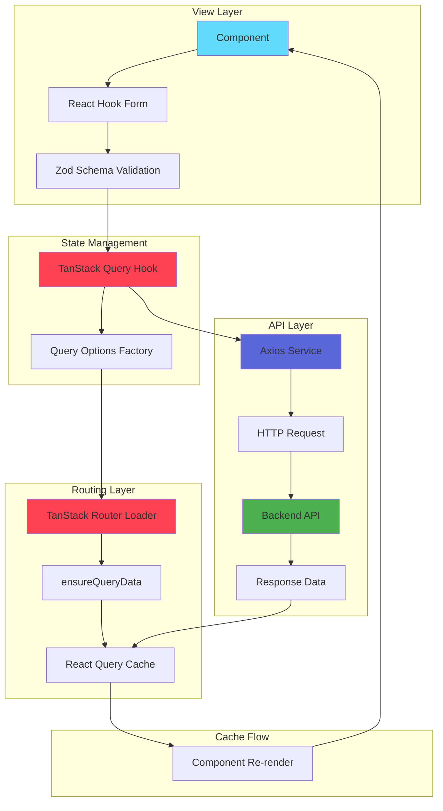

<div align="center">

# 🚀 Titanium React Starter

**Template React Enterprise-Grade focado em Escalabilidade, Modularidade e AI-Native DX**

[](https://react.dev/)
[](https://vitejs.dev/)
[](https://www.typescriptlang.org/)
[](https://tailwindcss.com/)
[](https://tanstack.com/router)
[](https://tanstack.com/query)
[](https://vitest.dev/)
[](https://zod.dev/)

</div>

---

## 📋 Índice

- [⚡ Tech Stack & Diferenciais](#-tech-stack--diferenciais)
- [🤖 O Gerador de Código (Killer Feature)](#-o-gerador-de-código-killer-feature)
- [🏗️ Arquitetura e Padrões](#️-arquitetura-e-padrões)
- [🚀 Getting Started](#-getting-started)
- [📊 Fluxo de Dados](#-fluxo-de-dados)

---

## ⚡ Tech Stack & Diferenciais

### Core Technologies

| Categoria | Tecnologia | Versão | Propósito |
| --------- | ---------- | ------ | --------- |
| **Framework** | React | 19.2.0 | UI Library |
| **Build Tool** | Vite | 7.2.4 | Build System & Dev Server |
| **Language** | TypeScript | 5.9.3 | Type Safety |
| **Styling** | Tailwind CSS | v4 | Utility-First CSS |
| **UI Components** | Shadcn/UI | Latest | Component Library |
| **Routing** | TanStack Router | 1.154.6 | File-based Routing |
| **Data Fetching** | TanStack Query | 5.90.19 | Server State Management |
| **Forms** | React Hook Form + Zod | Latest | Form Validation |
| **Testing** | Vitest | 4.0.17 | Unit Testing |

### 🎯 Diferenciais Arquiteturais

#### 1. **Arquitetura Modular (DDD-Inspired)**

Separação estrita entre **Roteamento** (`src/app/`) e **Regras de Negócio** (`src/modules/`):

- `src/app/`: Apenas definições de rota e loaders (magros)
- `src/modules/`: Toda a lógica de negócio isolada por domínio
- Zero acoplamento entre rotas e módulos

#### 2. **TanStack Ecosystem**

- **Router**: File-based routing com TypeScript end-to-end
- **Query v5**: Server state management com cache inteligente
- Integração nativa: Loaders pré-carregam dados via `ensureQueryData`

#### 3. **Tailwind CSS v4 (CSS-First)**

- Configuração via `@theme` no CSS (sem `tailwind.config.js` complexo)
- Sistema de tokens semânticos para Dark/Light Mode automático
- Zero configuração manual de cores hardcoded

#### 4. **AI-Native Developer Experience**

- Projeto configurado com `.cursor/rules` para garantir consistência
- Padrões arquiteturais documentados para assistência por IA
- Naming conventions estritas (Interfaces: `I*`, Types: `T*`)

---

## 🤖 O Gerador de Código (Killer Feature)

Este projeto possui um **CLI poderoso** que gera módulos CRUD completos em segundos, seguindo todos os padrões arquiteturais do projeto.

### 🎬 Como Usar

```bash
npm run gen:module -- --name=client --pt=clientes
```

**Parâmetros:**

- `--name`: Nome do módulo em kebabCase (ex: `client`, `userProfile`)
- `--pt`: Label em português para exibição (ex: `clientes`, `perfil-usuario`)

### 📦 O Que É Gerado

O comando cria uma estrutura completa e funcional:

```plaintext
src/modules/client/
├── components/              # Formulários e componentes visuais
│   └── client-form.tsx
├── create/                  # Lógica e View de Criação
│   ├── client-create.tsx
│   ├── schema.ts            # Validação Zod
│   └── use-client-create.ts # Hook de criação
├── update/                  # Lógica e View de Edição
│   ├── client-update.tsx
│   ├── schema.ts
│   └── use-client-update.ts
├── list/                    # Listagem com DataTable
│   ├── columns.tsx           # Definição de colunas (TanStack Table)
│   ├── client-list.tsx
│   ├── client-list-skeleton.tsx
│   └── use-client-list.ts
├── http/                    # Camada de Rede
│   ├── api/                 # Chamadas Axios puras (sem hooks)
│   │   └── index.ts
│   ├── mutations/           # Hooks de Mutação (Create/Update/Delete/Toggle)
│   │   ├── use-client-create.ts
│   │   ├── use-client-update.ts
│   │   ├── use-client-delete.ts
│   │   └── use-client-toggle-status.ts
│   └── queries/             # Query Options (Factory Pattern)
│       └── index.ts
└── _app-routes/             # Arquivos de rota (TanStack Router)
    ├── index.tsx            # Listagem
    ├── criar.tsx            # Criação
    └── $client_id.tsx       # Detalhe/Edição
```

### ✨ Funcionalidades Geradas Automaticamente

- ✅ **CRUD Completo**: Create, Read, Update, Delete
- ✅ **Listagem Paginada**: Com busca, filtros e ordenação
- ✅ **Validação de Formulários**: Schemas Zod prontos
- ✅ **Type Safety**: TypeScript end-to-end
- ✅ **Loading States**: Skeletons e pending components
- ✅ **Error Handling**: Tratamento de erros padronizado
- ✅ **Rotas Integradas**: File-based routing configurado

---

## 🏗️ Arquitetura e Padrões

### 📡 Data Fetching Pipeline

O projeto segue um pipeline estrito para busca de dados:

```plaintext
Service (API) → Query Options → Loader → Component
```

#### 1. **Service Layer** (`modules/{feat}/http/api`)

Funções assíncronas puras que executam chamadas HTTP:

```typescript
// modules/client/http/api/index.ts
export const clientApi = {
  list: async (params: TGenericListSchema) => 
    (await api.get('/clients', { params })).data,
  getById: async (id: string) => 
    (await api.get(`/clients/${id}`)).data,
}
```

#### 2. **Query Options** (`modules/{feat}/http/queries`)

Factory de `queryOptions` do TanStack Query:

```typescript
// modules/client/http/queries/index.ts
export const clientQueries = {
  list: (params: TGenericListSchema) => queryOptions({
    queryKey: ['clients', 'list', params],
    queryFn: () => clientApi.list(params),
    placeholderData: keepPreviousData, // UX: evita "pisca" de loading
  })
}
```

#### 3. **Loader** (`src/app/...`)

Pré-carrega dados na rota usando `ensureQueryData`:

```typescript
// src/app/_private/clientes/index.tsx
export const Route = createFileRoute("/_private/clientes/")({
  loader: ({ context, deps }) => 
    context.queryClient.ensureQueryData(clientQueries.list(deps)),
  component: ClientListPage,
});
```

#### 4. **Component**

Consome dados com `useSuspenseQuery` (dados já no cache):

```typescript
// modules/client/list/client-list.tsx
const { data } = useSuspenseQuery(clientQueries.list(params));
```

### 📝 Formulários (React Hook Form + Zod)

Padrão obrigatório para todos os formulários:

1. **Schema Zod**: Define validação e tipos
2. **React Hook Form**: Controla estado do formulário
3. **Shadcn Form Components**: UI consistente

```typescript
// 1. Schema
const formSchema = z.object({
  name: z.string().min(1, "Nome é obrigatório"),
  email: z.string().email("Email inválido"),
});

type TFormData = z.infer<typeof formSchema>;

// 2. Form Hook
const form = useForm<TFormData>({
  resolver: zodResolver(formSchema),
});

// 3. UI (Shadcn)
<FormField
  control={form.control}
  name="name"
  render={({ field }) => (
    <FormItem>
      <FormLabel>Nome</FormLabel>
      <FormControl>
        <Input {...field} />
      </FormControl>
      <FormMessage />
    </FormItem>
  )}
/>
```

### 🧪 Testes (Vitest)

Padrões de teste seguindo **Branch Coverage**:

- ✅ **Happy Path**: Caso de uso padrão
- ⚠️ **Null/Undefined**: Tratamento de valores opcionais
- 🛑 **Error Handling**: Blocos `try/catch`
- 🔄 **Condicionais**: Todos os branches de `if/else`
- 📏 **Boundaries**: Limites de strings e arrays

```typescript
describe('ClientService', () => {
  describe('getById', () => {
    it('should return client data when id is valid', () => { ... });
    it('should throw error when id is invalid', () => { ... });
    it('should handle undefined id gracefully', () => { ... });
  });
});
```

### 🎨 Theming (Dark/Light Mode)

Sistema de tokens semânticos que funciona automaticamente:

```css
/* ❌ EVITE: Cores hardcoded */
bg-white text-black border-gray-200

/* ✅ USE: Tokens semânticos */
bg-background text-foreground border-border
```

O Tailwind v4 resolve automaticamente as cores baseado na classe `.dark` no root.

---

## 🚀 Getting Started

### Pré-requisitos

- Node.js 18+
- npm ou yarn

### Instalação

```bash
# Clone o repositório
git clone https://github.com/celsolnv/react-base.git
cd react-base

# Instale as dependências
npm install
```

### Desenvolvimento

```bash
# Inicie o servidor de desenvolvimento
npm run dev

# O app estará disponível em http://localhost:5173
```

### Build

```bash
# Build para produção
npm run build

# Preview da build
npm run preview
```

### Testes

```bash
# Executar testes
npm run test

# Modo watch
npm run test:watch

# Com cobertura
npm run test:toPush
```

### Linting

```bash
# Verificar código
npm run lint

# Corrigir automaticamente
npm run lint:fix
```

### Gerar Novo Módulo

```bash
# Gere um módulo CRUD completo
npm run gen:module -- --name=product --pt=produtos
```

---

## 📊 Fluxo de Dados

O diagrama abaixo ilustra o fluxo completo de dados em um módulo gerado, desde a interação do usuário até a API:



### 🔄 Explicação do Fluxo

1. **Usuário interage** com o formulário (Component)
2. **React Hook Form** gerencia o estado local
3. **Zod** valida os dados antes do submit
4. **TanStack Query Hook** (mutation) executa a ação
5. **Axios Service** faz a requisição HTTP
6. **Backend API** processa e retorna dados
7. **React Query Cache** armazena a resposta
8. **Component** re-renderiza com dados atualizados

**Para leitura de dados:**

- O **Loader** do TanStack Router pré-carrega dados via `ensureQueryData`
- O componente usa `useSuspenseQuery` para acessar dados já em cache
- Zero loading states manuais necessários

---

## 📚 Estrutura de Pastas

```plaintext
src/
├── app/                    # Rotas (TanStack Router)
│   ├── __root.tsx         # Root layout
│   ├── _public/           # Rotas públicas
│   └── _private/           # Rotas protegidas
├── modules/                # Módulos de negócio (DDD)
│   ├── user/              # Exemplo: módulo de usuários
│   │   ├── components/
│   │   ├── create/
│   │   ├── update/
│   │   ├── list/
│   │   └── http/
│   └── template-base/      # Template para gerador
├── components/             # Componentes compartilhados
│   ├── layouts/
│   └── shared/
├── lib/                    # Configurações de infra
│   ├── query-client.ts
│   └── api-client.ts
├── constants/              # Constantes globais
└── global.css              # Tailwind v4 (@theme)
```

---

## 🎓 Padrões de Código

### Naming Conventions

- **Interfaces**: Sempre começam com `I` (ex: `IUserData`)
- **Types**: Sempre começam com `T` (ex: `TUserRole`)
- **Components**: PascalCase (ex: `UserForm`)
- **Hooks**: camelCase com prefixo `use` (ex: `useUserList`)
- **Files**: kebab-case (ex: `user-form.tsx`)

### Imports

Use path aliases configurados:

```typescript
// ✅ Correto
import { Button } from "@/components/ui/button";
import { userApi } from "@/modules/user/http/api";

// ❌ Evite
import { Button } from "../../../components/ui/button";
```

---

## 🤝 Contribuindo

Este é um template/boilerplate. Sinta-se à vontade para:

1. Fork o projeto
2. Crie uma branch para sua feature (`git checkout -b feature/AmazingFeature`)
3. Commit suas mudanças (`git commit -m 'Add some AmazingFeature'`)
4. Push para a branch (`git push origin feature/AmazingFeature`)
5. Abra um Pull Request

---

## 📄 Licença

Este projeto está sob a licença MIT. Veja o arquivo `LICENSE` para mais detalhes.

---

<div align="center">

**Desenvolvido com ❤️ usando React, TypeScript e TanStack Ecosystem**

[⭐ Dê uma estrela](https://github.com) • [🐛 Reportar Bug](https://github.com) • [💡 Sugerir Feature](https://github.com)

</div>
